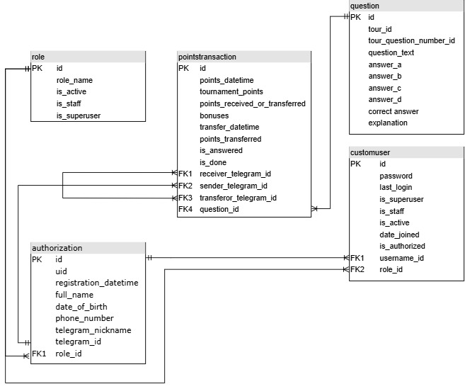

# Алгоритм запуска проекта

1. Настройте виртуальное окружение и подключитесь к нему (``venv\Scripts\activate`` - для Windows, ``source venv/bin/activate`` - для MacOS и Linux)
```bash
python -m venv venv
venv\Scripts\activate
```

2. Установите зависимости:
```bash
pip install -r requirements.txt
```

3. Вставьте секретный ключ для подключения к Django (SECRET_KEY) и токен для подключение к чат-боту Telegram (BOT_TOKEN) внутри ``quiz/settings.py``:
```python
from pathlib import Path

# Telegram bot token
BOT_TOKEN = '1111111111:AAAAAA1a11a1l1aaAaAaAaA11aaa1AaaA1A'

# Build paths inside the project like this: BASE_DIR / 'subdir'.
BASE_DIR = Path(__file__).resolve().parent.parent

# Quick-start development settings - unsuitable for production
# See https://docs.djangoproject.com/en/5.0/howto/deployment/checklist/

# SECURITY WARNING: keep the secret key used in production secret!
SECRET_KEY = 'SECRET_KEY'
```

4. Осуществите команды для создания миграций приложения с БД:
```bash
python manage.py makemigrations
python manage.py migrate
```

5. Создайте суперпользователя:
```bash
python manage.py createsuperuser
```

6. Настройте конфигурации для подключения к файлу bot.py через ``Edit Configurations`` в Pycharm

7. Запустите файл ``bot.py`` через кнопку "Run"

8. Запустите приложение:
```bash
python manage.py runserver
```

# Структура проекта
```
quiz/
├─ __init__.py
├─ asgi.py
├─ settings.py
├─ urls.py
├─ wsgi.py

tgbot/
├─ __init__.py
├─ migrations/
│  ├─ __init__.py
├─ admin.py
├─ apps.py
├─ models.py
├─ tests.py
├─ views.py

bot.py
manage.py
requirements.txt
.gitignore
README.md
```

- Файлы, которые были задействованы для разработки проекта:
  - bot.py: написание функционала чат-бота Telegram
  - models.py: построение таблиц в БД SQLite
  - admin.py: настройка админской панели
  - settings.py: добавление токен для подключения к чат-боту Telegram
  - requirements.txt: список библиотек для установки

# Структура БД



- role: таблица с ролями пользователей (админ, директор, участник)
  - role_name: название роли (админ, директор, участник)
  - is_active - статус активности (активен, неактивен при работе с приложением)
  - is_staff - статус сотрудника
  - is_superuser - статус суперпользователя


- authorization: таблица с данными о зарегистрированном пользователе
  - uid: уникальный идентификатор пользователя 
  - registration_datetime: дата регистрации 
  - full_name: ФИО пользователя
  - date_of_birth: дата рождения пользователя
  - phone_number: номер телефона
  - telegram_nickname: никнейм в Telegram 
  - telegram_id: Telegram ID пользователя
  - role_id: ID роли пользователя (1 - админ, 2 - директор, 3 - участник)


- customuser: таблица с дополнительными сведениями о зарегистрированных пользователях (содержит функционал класса ```AbstractUser```)
  - password: пароль для входа в приложение (должен быть хешированным)
  - last_login: дата последнего входа пользователя в приложение
  - is_superuser: статус суперпользователя
  - is_staff: статус сотрудника
  - is_active: статус активности (активен, неактивен при работе с приложением)
  - data_joined: дата, когда пользователь был зарегистрирован
  - is_authorized: статус авторизации пользователя (1 - авторизован, 0 - не авторизован)
  - username_id: ID пользователя из таблицы authorization
  - role_id: ID роли пользователя из таблицы role


- pointstransaction: таблица с данными о начисленных и списанных баллах
  - points_datetime: дата и время начисления или списания баллов
  - tournament_points: количество баллов, начисленных по 1-му типу (порядковый номер занятого места с шагом 5 баллов)
  - points_received_or_transferred: количество баллов, начисленных по 2-му типу (РОТ/ПОТ)
  - bonuses: количество баллов, начисленных по 3-му типу (бонусы)
  - transfer_datetime: дата и время списания баллов (применим к 4-му типу начисления баллов)
  - points_transferred: количество баллов, списанных по 4-му типу (перекидывание баллов от одного участника к другому)
  - is_answered: статус отвечен вопрос корректно или нет (1 - ответ верный, 0 - дан неверный ответ)
  - is_done: столбец для пометки пройден ли вопрос участником или нет (0 - участник дал ответ на вопрос, 1 - наоборот)
  - receiver_telegram_id: Telegram ID получателя баллов по 4-му типу (перекидывание баллов от одного участника к другому)
  - sender_telegram_id: Telegram ID отправителя баллов по 4-му типу (перекидывание баллов от одного участника к другому) / Telegram ID участника, получившего баллы по типам 1-3
  - transferor_telegram_id: Telegram ID директора, ответственного за перекидывание баллов по 4-му типу
  - question_id - ID вопроса из таблицы Question


- question: таблица с данными по вопросам и ответам на них
  - tour_id: номер тура 
  - tour_question_number_id: номер вопроса в туре 
  - question_text: текст вопроса 
  - answer_a: вариант ответа A 
  - answer_b: вариант ответа B 
  - answer_c: вариант ответа C 
  - answer_d: вариант ответа D
  - correct_answer - столбец, обозначающий правильный ответ (A, B, C, D)
  - explanation - объяснение к правильному ответу


# Видеодемонстрация чат-бота ТГ
- Ссылка на видеодемонстрацию: https://drive.google.com/file/d/1GioVvQSoHVtV0hJKbFgTSVc9BBzkeYE1/view?usp=sharing


# Команды чат-бота Telegram
- ```/start```: запуск чат-бота
- ```/register```: регистрация пользователя
- ```/login```: вход пользователя в приложение
- ```/logout```: выход пользователя из приложения
- ```/main_menu```: выход в главное меню


- ```/start_quiz```: запуск викторины для участника
- ```/add_points```: добавление очков участнику по одному из четырех типов


- ```/tournament_rating```: просмотр общего рейтинга участников по кол-ву баллов
-  ```/participant_rating```: просмотр индивидуального рейтинга участника
- ```/answers_rating```: общий рейтинг участников по количеству правильных ответов


- ```/tour_statistics```: просмотр рейтинга участников по кол-ву баллов в разрезе тура
- ```/tours_statistics```: просмотр рейтинга участников по кол-ву баллов в разрезе всех туров (по отдельности)


# Возможности администратора в админке Django

- После входа в админку (http://127.0.0.1:8000/admin/) у администратора появятся следующие возможности:
  - добавление новой роли (в случае наличия необходимости) в ``TGBOT/Roles`` (``ADD ROLE +``)
  - формирование новых вопросов с конкретными вариантами ответа в ``TGBOT/Questions`` (``ADD QUESTION +``)
  - добавление и редактирование пользователей в ``TGBOT/Authorizations`` (``ADD AUTHORIZATION +``) и ``TGBOT/Users`` (``ADD USER +``)
